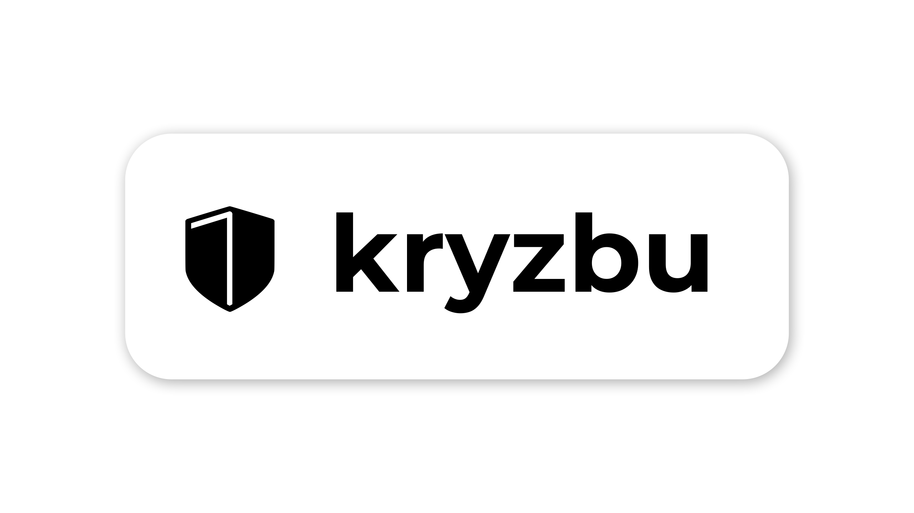

<h1 align="center"> 

</h1>

<h4 align="center">
Kryptograficky zabezpečené úložiště  🔒
</h4>

  Zkratky, aneb dostaň se rychleji k cíly...

 <strong>
   <a href="./docs/">Dokumentace</a>
  •
  <a href="./services">Služby</a>
  •
  <a href="./sources">Zdroje</a>
   •
  <a href="./graphics">Grafika</a>
 </strong>

 

  <b>TODO</b>: Dokončit Readme.md

------

 <b>kryzbu</b> – Kryptograficky zabezpečené úložiště. 

